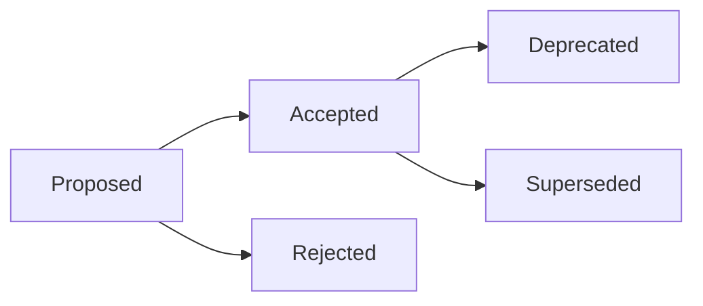

# Architecture Decision Records (ADR)

This directory contains Architecture Decision Records (ADRs) for the ol-infrastructure project.

## What is an ADR?

An **Architecture Decision Record** (ADR) is a document that captures an important architectural decision made along with its context and consequences.

An **Architecture Decision** (AD) is a software design choice that addresses a significant requirement.

An **Architecture Decision Log** (ADL) is the collection of all ADRs created and maintained for a particular project (or organization).

**Key characteristics:**
- Documents the "why" behind important decisions
- Captures context at the time of decision
- Records consequences (both positive and negative)
- Immutable once accepted (supersede with new ADRs rather than editing)
- Lightweight and easy to create

## When to Create an ADR

Create an ADR when making decisions that:

### Infrastructure & Architecture
- ✅ Change fundamental infrastructure patterns (e.g., ingress controller migration)
- ✅ Introduce new core technologies or platforms
- ✅ Modify deployment strategies or CI/CD patterns
- ✅ Change monitoring, logging, or observability approaches
- ✅ Alter security or authentication mechanisms
- ✅ Impact multiple applications or teams

### Complexity & Risk
- ✅ Have significant complexity or risk
- ✅ Require substantial effort (>8 hours) to implement or reverse
- ✅ Affect system reliability, performance, or scalability
- ✅ Create technical debt or constraints for future decisions

### Team & Organizational
- ✅ Need buy-in from multiple stakeholders
- ✅ Will affect future developers' understanding
- ✅ Set precedents for future similar decisions
- ✅ Resolve disagreements or debates within the team

### Cost & Resources
- ✅ Have significant financial implications
- ✅ Require resource allocation (time, budget, tooling)

## When NOT to Create an ADR

Skip an ADR for decisions that are:

- ❌ **Trivial or standard practice** - Following established patterns (e.g., using standard Pulumi resources)
- ❌ **Temporary** - Workarounds, experiments, or POCs that won't persist
- ❌ **Fully reversible** - Easy to undo with minimal cost (<1 hour)
- ❌ **Already documented** - Covered by existing policies, standards, or documentation
- ❌ **Implementation details** - Low-level code choices that don't affect architecture
- ❌ **Single-developer scope** - Isolated changes that don't impact others

**Rule of thumb:** If future you (6 months later) would ask "Why did we do it this way?", write an ADR.

## ADR Format

We use a simplified version of Michael Nygard's template:

```markdown
# {Number}. {Title}

**Status:** {Proposed | Accepted | Rejected | Deprecated | Superseded by ADR-XXX}
**Date:** {YYYY-MM-DD}
**Deciders:** {List of people involved in decision}
**Technical Story:** {Issue/PR/Discussion link}

## Context

What is the issue that we're seeing that is motivating this decision or change?

- Current situation
- Business/technical drivers
- Constraints and requirements
- Options considered

## Decision

What is the change that we're proposing and/or doing?

- Clear statement of the decision
- Rationale for choosing this option
- Key implementation details if relevant

## Consequences

What becomes easier or more difficult to do because of this change?

### Positive
- Benefits and improvements
- Problems solved

### Negative
- Trade-offs and downsides
- New constraints or technical debt
- Risks

### Neutral
- Changes that are neither clearly positive nor negative
- Follow-up work required
```

## File Naming Convention

ADRs are numbered sequentially and use the following format:

```
NNNN-title-with-dashes.md
```

Examples:
- `0001-use-pulumi-for-infrastructure.md`
- `0002-migrate-to-gateway-api-httproute.md`
- `0003-adopt-eks-for-container-orchestration.md`

**Numbering:**
- Start at `0001`
- Use 4-digit zero-padded numbers
- Numbers are permanent (don't renumber when superseding)

**Titles:**
- Use lowercase with dashes
- Be concise but descriptive
- Start with a verb (use, adopt, migrate, implement, etc.)

## ADR Lifecycle



### Status Definitions

- **Proposed** - Under discussion, not yet decided
- **Accepted** - Decision approved and being implemented
- **Rejected** - Considered but not chosen
- **Deprecated** - No longer recommended but still in use
- **Superseded** - Replaced by a newer ADR (link to new ADR)

### Status Transitions

1. **Draft** → Create ADR with "Proposed" status
2. **Review** → Team discusses, may request changes
3. **Decision** → Mark as "Accepted" or "Rejected"
4. **Implementation** → Execute the decision
5. **Evolution** → May eventually become "Deprecated" or "Superseded"

## ADR Index

| ADR | Title | Status | Date |
|-----|-------|--------|------|
| [0001](0001-use-adr-for-architecture-decisions.md) | Use ADR for Architecture Decisions | Accepted | 2025-10-29 |
| [0002](0002-migrate-to-gateway-api-httproute.md) | Migrate to Gateway API HTTPRoute | Proposed | 2025-10-29 |

## Creating a New ADR

### Option 1: Use the Template

1. Copy `template.md` to a new file with the next sequential number
2. Fill in the sections
3. Create a PR for team review
4. Update the index above

### Option 2: Use adr-tools (Optional)

```bash
# Install adr-tools
brew install adr-tools  # macOS
# or download from https://github.com/npryce/adr-tools

# Create new ADR
adr new "Migrate to Gateway API HTTPRoute"

# Supersede an old ADR
adr new -s 2 "Use different ingress controller"

# Generate table of contents
adr generate toc > README.md
```

## Best Practices

### Writing ADRs

1. **Be concise** - Aim for 1-2 pages maximum
2. **Be specific** - Include concrete examples and data
3. **Be honest** - Document negative consequences too
4. **Be timely** - Write ADRs when making decisions, not after
5. **Be clear** - Future readers may not have your context

### Context Section

- Explain business and technical drivers
- Include relevant metrics, data, or research
- List options considered (not just the chosen one)
- Document constraints and requirements
- Reference related ADRs or documentation

### Decision Section

- State the decision clearly and unambiguously
- Explain why this option was chosen over alternatives
- Keep it brief - details go in implementation docs
- Link to technical specs or design docs if needed

### Consequences Section

- Be realistic about trade-offs
- Consider short-term and long-term impacts
- Think about effects on: performance, cost, complexity, maintenance, team skills
- Identify follow-up work or new ADRs needed

## Review Process

### For Proposed ADRs

1. Create ADR with "Proposed" status
2. Open PR with ADR file
3. Tag relevant stakeholders for review
4. Discuss in PR comments or team meeting
5. Update ADR based on feedback
6. When consensus reached, merge PR and mark "Accepted"

### For Agentic Coding Sessions

When AI agents make architectural decisions:

1. Agent creates ADR during session
2. Documents options explored and rationale
3. Marks status as "Proposed"
4. Human reviewer:
   - Reviews decision quality
   - Validates against project goals
   - Marks "Accepted" if approved
   - May request changes or mark "Rejected"

## Reviewing Old ADRs

**Monthly ADR Review** (recommended):
- Review recent ADRs (last 1-3 months)
- Compare predictions vs reality
- Document learnings in ADR comments or new ADRs
- Update status if needed (Accepted → Deprecated)

**Annual ADR Audit**:
- Review all active ADRs
- Identify deprecated or superseded decisions
- Archive or update ADRs as needed
- Extract patterns for new best practices

## Integration with Development Workflow

### Pulumi Changes

When making Pulumi infrastructure changes:
1. Small changes (< 2 hours) - No ADR needed
2. Medium changes (2-8 hours) - Consider ADR for reusable patterns
3. Large changes (> 8 hours) - ADR required

### Multi-Stack Changes

When changes affect multiple Pulumi stacks:
- Always create an ADR
- Document migration strategy
- Link to planning docs (like `gateway-api-migration-plan.md`)

### Breaking Changes

Any breaking change requires an ADR documenting:
- What is breaking
- Why the break is necessary
- Migration path for affected users
- Timeline for deprecation

## Examples from Other Projects

- [AWS Prescriptive Guidance - ADRs](https://docs.aws.amazon.com/prescriptive-guidance/latest/architectural-decision-records/welcome.html)
- [GitHub Engineering ADRs](https://github.blog/2020-08-13-why-write-adrs/)
- [Spotify Backstage ADRs](https://github.com/backstage/backstage/tree/master/docs/architecture-decisions)
- [Microsoft Azure ADRs](https://docs.microsoft.com/en-us/azure/architecture/framework/devops/adrs)

## Resources

- [ADR GitHub Organization](https://adr.github.io/) - Main ADR resource site
- [ADR Tools](https://github.com/npryce/adr-tools) - Command-line tools for managing ADRs
- [Michael Nygard's Original Article](https://www.cognitect.com/blog/2011/11/15/documenting-architecture-decisions) - First ADR proposal
- [Architecture Decision Records: A Primer](https://github.com/joelparkerhenderson/architecture-decision-record) - Comprehensive guide

## Questions?

If you're unsure whether something needs an ADR:
1. Ask yourself: "Will this decision matter in 6 months?"
2. Consult with the platform team
3. When in doubt, write it out - better to have too many than too few

---

**Last Updated:** 2025-10-29
**Maintainers:** Platform Team
