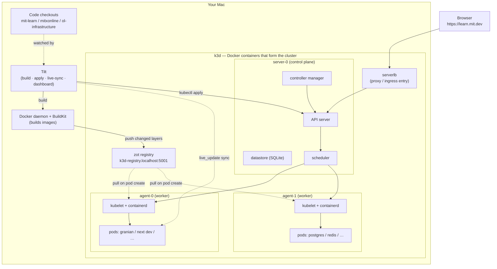
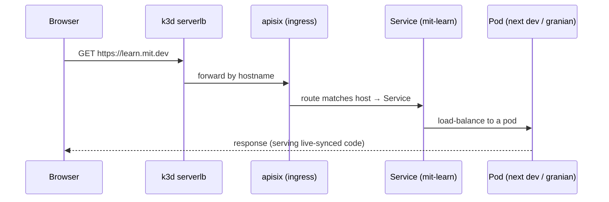
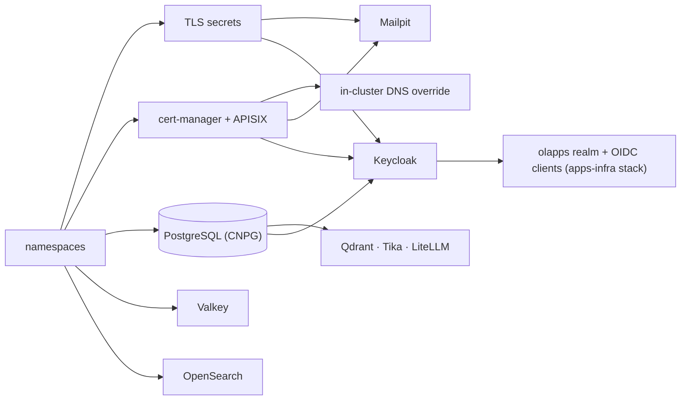

# Local-dev architecture

A mental model of the local development stack for people who are comfortable with Docker / Docker Compose but new to Kubernetes. It maps the k8s concepts back onto compose wherever possible. Nothing here is required reading — the [README](README.md) covers setup and day-to-day usage — but it makes the stack's behavior much easier to predict.

The whole stack runs on your laptop. What looks like a Kubernetes "cluster" is just a handful of Docker containers.

## Table of Contents

1. [The layers, bottom to top](#the-layers-bottom-to-top)
2. [Control plane vs. data plane](#control-plane-vs-data-plane)
3. [Docker Compose → Kubernetes, translated](#docker-compose--kubernetes-translated)
4. [The architecture, drawn](#the-architecture-drawn)
5. [What runs in the cluster](#what-runs-in-the-cluster)
6. [Design decisions](#design-decisions)
7. [Request tracing — one browser request](#request-tracing--one-browser-request)
8. [Why Tilt exists](#why-tilt-exists)
9. [Two transports: how your code reaches a pod](#two-transports-how-your-code-reaches-a-pod)
10. [What happens on `tilt up`](#what-happens-on-tilt-up)
11. [The raw k8s dev flow (what Tilt automates)](#the-raw-k8s-dev-flow-what-tilt-automates)

## The layers, bottom to top

| Layer | What it is | Compose analogy |
| --- | --- | --- |
| **Code** | Your local checkouts (`mit-learn`, `mitxonline`, `ol-infrastructure`) | the source you bind-mount |
| **Docker / BuildKit** | Builds images. Unchanged from what you know. | same |
| **k3d + k3s** | A real, lightweight Kubernetes cluster running *inside Docker containers* | the "host" your services run on |
| **k8s manifests + apisix** | Declarative description of what should run + hostname routing | the `docker-compose.yml` + a reverse-proxy container |
| **Pulumi** | Installs the shared services (Postgres, Keycloak, APISIX, …) into the cluster | the `postgres:` / `redis:` blocks of a compose file, factored out and shared by every app |
| **Tilt** | The dev loop: builds images, applies manifests, live-syncs code | `docker compose up` + a file-watcher + rebuild orchestration |

### Docker

Same as always: images are filesystem snapshots, containers are running instances, built by BuildKit. Everything above this layer is just a question of *what runs where*.

### k3d + k3s — where the cluster physically lives

- **k3s** is a complete, certified-but-lightweight Kubernetes, packaged by Rancher as a single binary. Same `kubectl`, same manifests as rc/prod.
- **k3d** runs k3s *inside Docker containers*. Your "cluster" is these containers on your Mac:

  ```
  k3d-local-dev-server-0    rancher/k3s     control-plane node (the brain)
  k3d-local-dev-agent-0     rancher/k3s     worker node
  k3d-local-dev-agent-1     rancher/k3s     worker node
  k3d-local-dev-serverlb    k3d-proxy       load-balancer in front of the API / ingress
  k3d-registry.localhost    zot             local image registry (with built-in retention)
  ```

Inside those node-containers, k3s runs its own container runtime (containerd), and *that* launches your app pods. So there is a nesting: your app containers run inside the k3d node-containers, not directly on your Mac's Docker daemon.

This is the closest thing to Vagrant: Vagrant gave you a disposable VM that behaved like a prod-like server. k3d gives you a disposable *Kubernetes cluster* made of Docker containers. `k3d cluster delete` and it's gone.

### k8s manifests + apisix — the declarative "compose file"

The manifests live in `local-dev/apps/*` (Deployments, Services, ConfigMaps, Secrets) and `apisix-routes.yaml`. This is the big conceptual leap from compose; see [Compose → Kubernetes](#docker-compose--kubernetes-translated) below.

### Pulumi — the shared-services installer

Pulumi is an infrastructure-as-code tool (same family as Terraform): you describe resources in a real programming language and `pulumi up` creates or updates the real thing to match. It's what this repo uses to define OL's rc/prod cloud infrastructure — which is why application engineers usually meet it as "the place env vars go to affect rc/prod." It does **not** play that role in local-dev: per-developer env vars go in a gitignored [`app-env.local.yaml` override](README.md#local-configuration-overrides) instead. Here Pulumi's job is smaller — a Python program under `local-dev/infra/` installs the shared in-cluster services every app needs (PostgreSQL, Valkey, Keycloak, APISIX, OpenSearch, …). Tilt runs `pulumi up` for you at startup and whenever the infra files change; the only time you touch it is to change shared infrastructure (see [EXTENDING.md](EXTENDING.md)).

### Tilt — the dev loop

Tilt is what you actually run (`tilt up`). It replaces the `docker compose up -d` + `compose logs -f` + rebuild-on-change habit. The `Tiltfile`s tell Tilt to build images with BuildKit, push them into the k3d cluster, `kubectl apply` the manifests, and then **watch your source files**. It gives you a web dashboard with per-service status and logs. See [Why Tilt exists](#why-tilt-exists).

## Control plane vs. data plane

Kubernetes splits *deciding what should run* from *actually running it*.

- **Control plane** = the brain (the `server-0` node here). It holds desired state, schedules work, and runs the reconcile loops. It does not normally run your app containers. Components (all bundled into the k3s binary):
  - **API server** — the front door. `kubectl`, Tilt, and the controllers all talk to it; it is the only thing that reads/writes cluster state.
  - **Datastore** — source of truth for desired + observed state (full k8s uses etcd; k3s defaults to embedded SQLite). `kubectl apply` writes here.
  - **Scheduler** — picks which worker node a new pod runs on.
  - **Controller manager** — runs the reconcile loops (e.g. the Deployment controller that respawns a pod you kill).
- **Data plane** = the workers (the `agent-*` nodes). Each runs a **kubelet** (takes orders from the control plane) and **containerd** (actually starts and stops containers). Your app pods run here.

```
$ kubectl get nodes
NAME                     ROLES                  ...
k3d-local-dev-agent-0    <none>                 # worker (data plane)
k3d-local-dev-agent-1    <none>                 # worker (data plane)
k3d-local-dev-server-0   control-plane,master   # brain (control plane)
```

Compose has no such split: the compose CLI reads your file and directly tells the one Docker daemon to run containers. There is no persistent brain watching and correcting. Kubernetes separates "decide + remember + reconcile" from "execute" so it can manage many machines and self-heal. k3d collapses all of it onto your Mac, but the *architecture* is identical to rc/prod — which is why the same manifests work in both.

## Docker Compose → Kubernetes, translated

| Compose concept | Kubernetes equivalent |
| --- | --- |
| a `service` (one container) | a **Pod** (one+ containers sharing one IP), managed by a **Deployment** |
| `docker compose up` | submit *desired state*; controllers make it true and keep it true |
| container dies → stays dead | Deployment **reconciles** — respawns the pod automatically |
| reach a service by name (compose DNS) | a **Service**: stable virtual IP + DNS name load-balancing to pods |
| `environment:` / `env_file:` | **ConfigMap** / **Secret** |
| a reverse-proxy container you add yourself | **Ingress / Gateway** (here: apisix), routing by hostname |
| compose "project" grouping | **Namespace** (`mit-learn`, `mitxonline`, …) |
| bind-mounting source for hot reload | **Tilt `live_update` sync** (push-based) |

The single biggest difference: **compose is imperative** ("run these containers now") while **k8s is declarative** ("here is the state I want; keep it true").

## The architecture, drawn



## What runs in the cluster

Inside the cluster, workloads are grouped into namespaces: one per app, plus `local-infra` for shared services and `operations` for ingress.

```
┌──────────────────────────────────────────────────────────────┐
│  k3d cluster: local-dev                                       │
│                                                               │
│  ┌──────────┐  ┌──────────────────────────────────────────┐  │
│  │operations│  │           local-infra                    │  │
│  │          │  │  PostgreSQL (CNPG)  Valkey  Qdrant       │  │
│  │  APISIX  │  │  OpenSearch  Tika  Keycloak  LiteLLM     │  │
│  │          │  │  Mailpit                                 │  │
│  └────┬─────┘  └──────────────────────────────────────────┘  │
│       │                                                       │
│       │  routes traffic by hostname                          │
│       ├──────────────────────────────────────────────────┐   │
│       │                                                  │   │
│  ┌────▼──────┐  ┌───────────┐  ┌──────────┐  ┌────────┐ │   │
│  │ mit-learn │  │ learn-ai  │  │mitxonline│  │  odl-  │ │   │
│  │  (ns)     │  │   (ns)    │  │   (ns)   │  │ video  │ │   │
│  │ Next.js   │  │ granian   │  │  uwsgi   │  │  uwsgi │ │   │
│  │ Django    │  │ Celery×2  │  │  Celery  │  │ Celery │ │   │
│  │ Celery×3  │  │           │  │          │  │        │ │   │
│  └───────────┘  └───────────┘  └──────────┘  └────────┘ │   │
└──────────────────────────────────────────────────────────────┘
         ▲
         │  HTTPS (mkcert TLS, trusted by OS)
    Developer browser / curl
```

The shared services in `local-infra`, briefly: **PostgreSQL** (one CNPG-managed cluster, one database per app), **Valkey** (the open-source Redis fork — the apps' Redis cache and Celery broker), **OpenSearch** (search), **Qdrant** (vector database for AI features), **Tika** (document text extraction), **LiteLLM** (proxy in front of LLM APIs), **Keycloak** (SSO), and **Mailpit** (catches all outbound email). In `operations`: **APISIX** (ingress — hostname routing, TLS termination, OIDC).

## Design decisions

**Ownership boundary:** `setup.sh` owns only the k3d cluster, TLS certificates, and `/etc/hosts`. _All_ in-cluster resources are owned by either Pulumi (shared infra) or Tilt (app manifests). This prevents drift and conflicts.

**APISIX as ingress:** Traefik is disabled in k3d. APISIX handles all ingress, TLS termination, and OIDC authentication (via the `openid-connect` plugin). Each app's `apisix-routes.yaml` declares its `ApisixRoute` and `ApisixTls` CRDs.

**Shared database cluster:** All apps share one CloudNativePG (CNPG) cluster in the `local-infra` namespace with isolated databases (`mitlearn`, `learnai`, `mitxonline`, `odlvideo`, `keycloak`, `litellm`). This keeps memory usage low.

**TLS:** mkcert generates a wildcard certificate for all `.dev` domains. The cert is read by Pulumi at stack evaluation time and stored as `local-dev-tls` Kubernetes Secrets in every app namespace. APISIX's `ApisixTls` CRs reference these secrets.

**Keycloak realm:** The `olapps` realm mirrors production, including the fake-Touchstone SAML IdP, all OIDC clients, and organizations support. Test accounts are listed in the [README](README.md#test-accounts).

## Request tracing — one browser request



In words: your hosts/DNS points `*.mit.dev` at the k3d `serverlb` → **apisix** matches the hostname and routes to the right **Service** → the Service load-balances to a **Pod** running `next dev` (frontend) or `granian` (Django) → that pod is serving code Tilt **live-synced** from your checkout seconds ago. Edit a file, HMR/reload repaints, no rebuild.

## Why Tilt exists

On raw Kubernetes, the naive dev loop is brutal:

```
edit code → rebuild image → load into cluster → roll the Deployment → wait for pod
```

That is seconds-to-minutes per change. Tilt's **`live_update`** fixes it: it watches your files and syncs the changed ones straight into the running container (conceptually a bind mount, but push-based), then either runs a small command (`uv sync` when the lockfile changes) or lets the process inside hot-reload on its own:

- Django: `granian --reload`
- Frontend: `next dev` HMR

No rebuild, no pod restart. That is what makes a k8s-based local stack feel as snappy as compose with a mounted volume. What to expect in practice (reload times, which containers auto-reload) is in the README under [Working with Apps](README.md#working-with-apps).

## Two transports: how your code reaches a pod

There are two entirely separate paths, and knowing which one is in play explains most of Tilt's behavior (and all of the disk usage).

**Transport 1 — `live_update` (the everyday one).** When you save a file, Tilt tars just the changed files and streams them into the *running container's* filesystem over the Kubernetes exec API — the same plumbing as `kubectl cp`. No image build, no registry, no pod restart; `granian --reload` / `next dev` notice the file change. This is the compose bind-mount feeling, implemented as push-based sync.

**Transport 2 — image rebuild → push → pull.** Used only when a file-copy can't express the change: Dockerfile edits, dependency changes the `live_update` `run()` steps can't handle, Tiltfile config changes, or a manual rebuild. This path exists because every container runtime has its own private **image store**: your Mac's Docker daemon has one (`docker images`), and each k3d node's containerd has its own. None of them can read each other's. The **registry** (`k3d-registry.localhost`, the zot container) is the network service that bridges them: Tilt pushes the freshly built image there, and each node's kubelet pulls from it like it would from Docker Hub.

What actually crosses the wire is negotiated, not the whole image. An image is a small JSON manifest plus content-addressed **layers**; push and pull both start by comparing digests and transfer only the layers the other side is missing. A rebuild typically changes only the top (code) layer, so the multi-GB base layers cross once and never again.

**The consequence that ties the two together:** live-synced code exists *only inside that one running container*. The image in the registry and the node stores stays as it was at the last rebuild. If a pod is recreated (node restart, eviction), it comes up from that stale image and Tilt immediately re-syncs your working tree over it. So the registry is the pods' *recovery path* even though your edits never flow through it — which is why its retention keeps a cushion of recent tags rather than only the latest (see [Disk Management](README.md#disk-management) in the README).

## What happens on `tilt up`

Tilt first runs `pulumi up` for the shared infrastructure. The Pulumi program is a dependency graph, not a script — an arrow below means "waits for"; anything not connected deploys in parallel:



Then, for each enabled app (apps deploy independently of each other):

```
├── docker build (if source repo present, else pull prebuilt image)
├── kubectl apply configmaps/ secrets.yaml deployment.yaml
│     initContainer: migrate + collectstatic + data-specific seeds
└── kubectl apply apisix-routes.yaml
      APISIX picks up new routes → app reachable at its .dev URL
```

## The raw k8s dev flow (what Tilt automates)

If you did it by hand, each change would be:

1. `docker build -t mitodl/mit-learn-app --target local-dev .`
2. `k3d image import mitodl/mit-learn-app -c local-dev` (get the image into the cluster — Tilt instead pushes to the local registry, which transfers only changed layers; `image import` copies every layer into every node each time)
3. `kubectl rollout restart deploy/mitlearn-webapp -n mit-learn`
4. `kubectl rollout status deploy/mitlearn-webapp -n mit-learn` (wait for the new pod)
5. `kubectl logs -f deploy/mitlearn-webapp -n mit-learn` (watch it come up)

Tilt collapses all of that into a file-watch + in-container sync, and shows the status/logs in one dashboard. The manual commands are still useful to know for debugging when something is stuck.

## See also

- [README.md](README.md) — setup and day-to-day usage
- [EXTENDING.md](EXTENDING.md) — adding a new app, modifying shared infrastructure
- `local-dev/apps/*/Tiltfile` — per-app build + live_update config
- `local-dev/apps/*/deployment.yaml` — per-app k8s manifests
