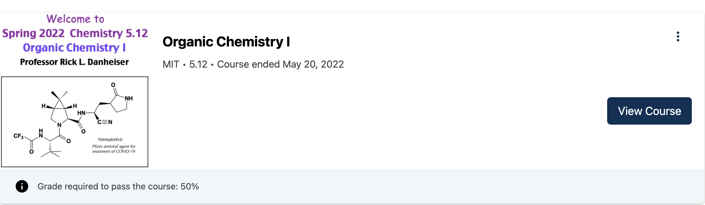

# Plugin Slots Overrides

This directory contains configuration for **MFE plugin slots** used to override default components in Open edX MFEs. These overrides allow us to customize the user experience and implement platform-specific requirements.

---

## Overview

Plugin slots provide extension points in Open edX MFEs where we can replace or augment existing components.
This documentation captures:

* **Which slots are overridden**
* **Why the override is needed**
* **Implementation details**
* **Screenshots/examples (if applicable)**

---

## Overrides

| Name / Slot ID                                                                 | Location (MFE)                         | Purpose                                                                                               | Notes / Screenshots / Code location                                                                 |
| ------------------------------------------------------------------------------ | -------------------------------------- | ----------------------------------------------------------------------------------------------------- | --------------------------------------------------------------------------------------------------- |
| `footer_slot` / `studio_footer_slot`                                           | All MFEs                               | Replaces default footer with our customized footer component.                                        |  — See [`Footer.jsx`](./Footer.jsx)                                                      |
| `ForceLoginRedirect` (component)                                          | MITxOnline and xPRO Learning MFE  | Redirects unauthorized users from the learning MFE to the login page.                                 | Search `ForceLoginRedirect` in [`Footer.jsx`](./Footer.jsx)                    |
| `learning_user_menu_slot` / `desktop_user_menu_slot`                           | All MFEs                               | Updates header menu links based on application (defined in `userMenu` object in config files).         |  Links defined in `common-mfe-config.env.jsx` files     |
| `progress_certificate_status_slot`                                             | xPRO Learning MFE Progress Page        | Replaces the certificate status text in MITxPRO Learning MFE Progress Page.                           |                                                                 |
| `org.openedx.frontend.learning.course_breadcrumbs.v1`                          | MITxOnline / MIT Learn Learning MFE    | Shows breadcrumbs navigation (hidden by default).                                                     |                                                                         |
| `org.openedx.frontend.learning.sequence_navigation.v1`                         | MITxOnline / MIT Learn Learning MFE    | Shows sequence navigation bar (hidden by default).                                                    |                                                                |
| `org.openedx.frontend.learning.course_outline_sidebar.v1`                      | MITxOnline / MIT Learn Learning MFE    | Hides the default course outline sidebar.                                                             |                                                             |
| `org.openedx.frontend.learning.course_outline_sidebar_trigger.v1`   `org.openedx.frontend.learning.course_outline_mobile_sidebar_trigger.v1` | MITxOnline / MIT Learn Learning MFE    | Hides default course outline sidebar trigger button.                                                   |                                                     |
| `org.openedx.frontend.learning.unit_title.v1`                                  | MITxOnline / MIT Learn Learning MFE    | Hides navigation arrow buttons from the unit title slot; replaced with custom implementation.          | Before:  After:            |
| `widget_sidebar_slot`                                                           | MITx Learner Dashboard                 | Hides the “Looking for a new challenge” banner in learner dashboard.                                   |                                                              |
| `org.openedx.frontend.layout.header_learning_course_info.v1`                   | MIT Learn MFEs                         | Hides course organization and number from UAI courses in the Learning Header.                         | Before:  After:  |
| `externalLinkUrlOverrides`                                                      | MITxOnline Proctoring Info Panel       | Overrides “Review instructions and system requirements” link → MITxOnline Zendesk Helpdesk.            | Search `externalLinkUrlOverrides` in [`mitxonline/common-mfe-config.env.jsx`](./mitxonline/common-mfe-config.env.jsx)                         |
| `mitx-styles.scss`                                                              | MITx Residential Learner Dashboard     | Hides information banner in dashboard cards via CSS overrides.                                        | Before:  After:  [`./mitx-styles.scss`](./mitx-styles.scss)                                                                                |

---

## How to Add or Update an Override

1. Identify the slot in the relevant MFE.
2. Implement the override in this directory (`slot_config`).
3. Update this `README.md`:

   * Add a row to the table above.
   * Include a short description of **why** the override exists.
   * Add screenshots (optional but recommended).

---

