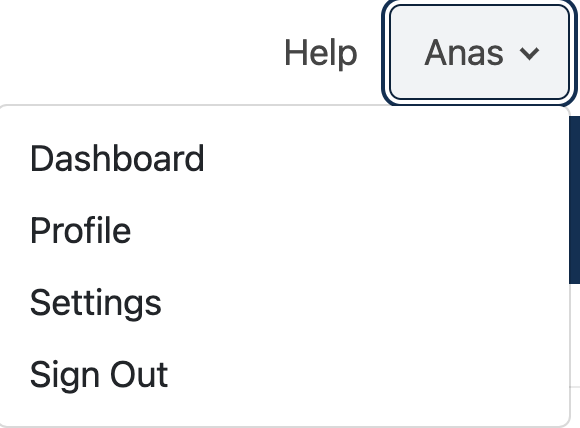
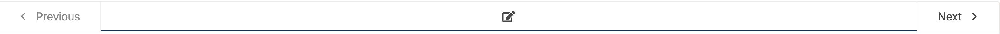
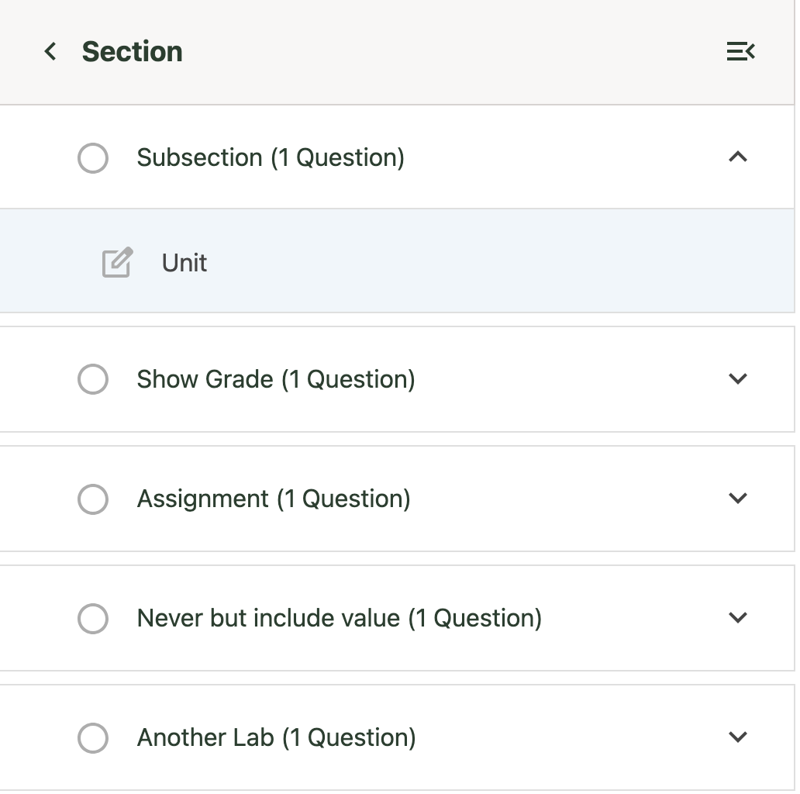
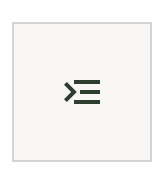
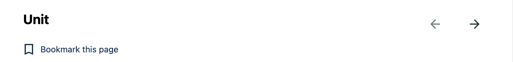

# Plugin Slots Overrides

This directory contains configuration for **MFE plugin slots** used to override default components in Open edX MFEs. These overrides allow us to customize the user experience and implement platform-specific requirements.

---

## Overview

Plugin slots provide extension points in Open edX MFEs where we can replace or augment existing components.
This documentation captures:

* **Which slots are overridden**
* **Why the override is needed**
* **Implementation details**
* **Screenshots/examples (if applicable)**

---

## Slot Overrides

| Slot Name                                   | Location (MFE)     | Purpose                                                            | Notes / Screenshots                 |
| ------------------------------------------- | ------------------ | ------------------------------------------------------------------ | ----------------------------------- |
| `footer_slot` / `studio_footer_slot`       | `All MFEs`         | Replaces default footer with our customized [footer](./Footer.jsx) |   |
| `learning_user_menu_slot`/`desktop_user_menu_slot`| `All MFEs`         | Updates the header menu links based on the application. The links are defined in the `userMenu` object within the config files.| |
| `progress_certificate_status_slot` | `xPRO Learning MFE Progress Page` | Replaces the certificate status text in MITxPRO Learning MFE Progress Page |  |
| `org.openedx.frontend.learning.course_breadcrumbs.v1` | `MITxOnline / MIT Learn Learning MFE` | Shows the breadcrumps navigation which is hidden by default |  |
| `org.openedx.frontend.learning.sequence_navigation.v1`| `MITxOnline / MIT Learn Learning MFE` | Shows the sequence navigation bar which is hidden by default |  |
| `org.openedx.frontend.learning.course_outline_sidebar.v1` | `MITxOnline / MIT Learn Learning MFE` | Hides the default course outline sidebar in MITxOnline Learning MFE |  |
| `org.openedx.frontend.learning.course_outline_sidebar_trigger.v1` / `org.openedx.frontend.learning.course_outline_mobile_sidebar_trigger.v1` | `MITxOnline / MIT Learn Learning MFE` | Hide the default course outline sidebar trigger button in MITxOnline Learning MFE | 
| `org.openedx.frontend.learning.unit_title.v1` | `MITxOnline / MIT Learn Learning MFE` | Hides the navigation arrow buttons from the unit title slot with a custom implementation in MITxOnline Learning MFE | Before:  After:  |
| `widget_sidebar_slot` | `MITx Learner Dashboard` | Hides the `Looking for a new challenge` banner in learner dashboard in MITx |  |
| `org.openedx.frontend.layout.header_learning_course_info.v1` | `MIT Learn MFEs` | Hides the course organization and number from UAI courses in the MIT Learn MFEs using Learning Header | Before:  After:  |

## Other Overrides

| Obverride Overview                          | Location

---

## How to Add or Update an Override

1. Identify the slot in the relevant MFE.
2. Implement the override in this directory (`slot_config`).
3. Update this `README.md`:

   * Add a row to the table above.
   * Include a short description of **why** the override exists.
   * Add screenshots (optional but recommended).

---

## Maintenance Notes

* Always document new overrides immediately.
* Review existing overrides periodically to confirm they are still needed.
* Remove outdated overrides and update this documentation accordingly.

---

## 🔗 References

* [Open edX MFE Plugin Slots documentation](https://github.com/openedx/frontend-plugin-framework)
* [Discussion thread on overrides](https://github.com/mitodl/hq/issues/8298#issuecomment-3274936062)

---
