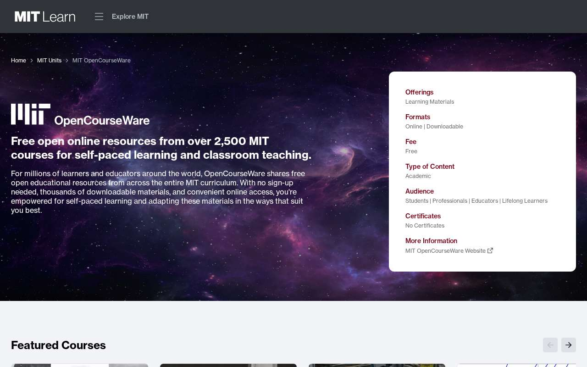
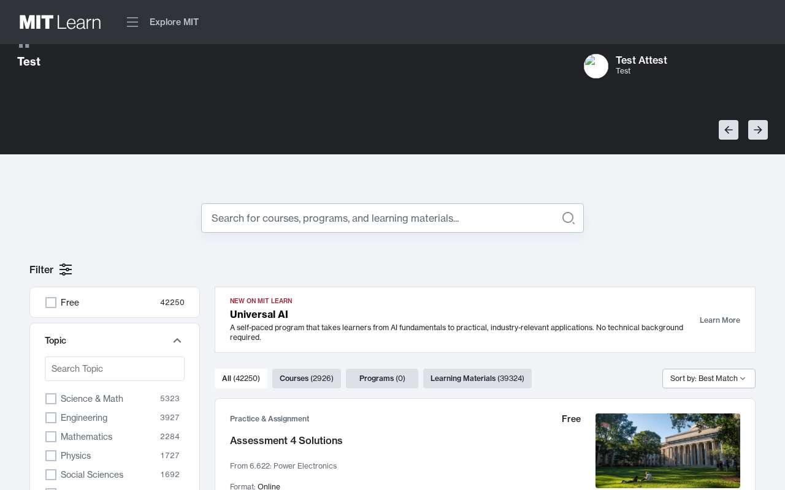
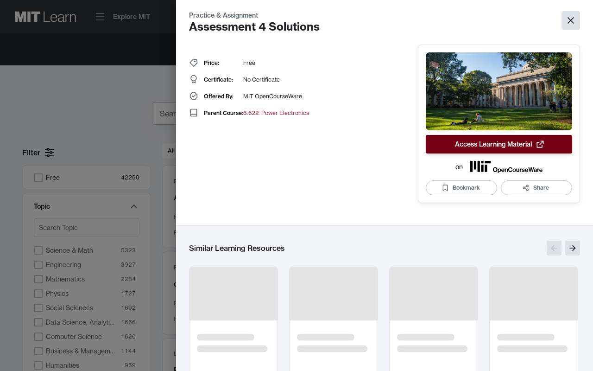
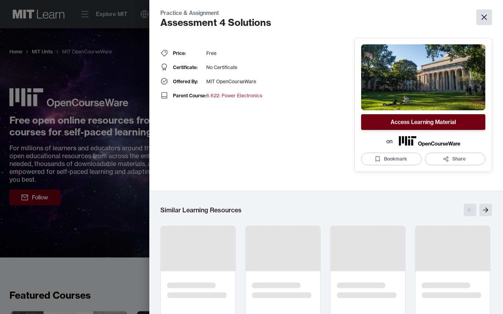
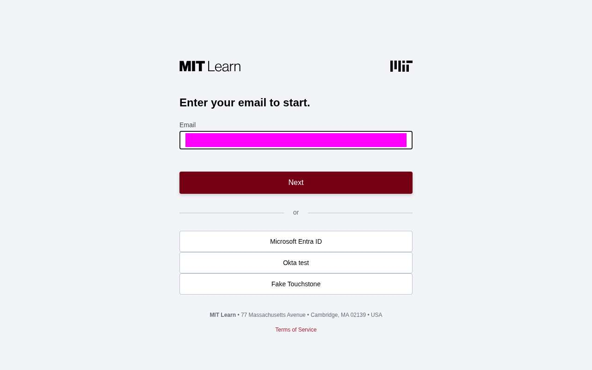
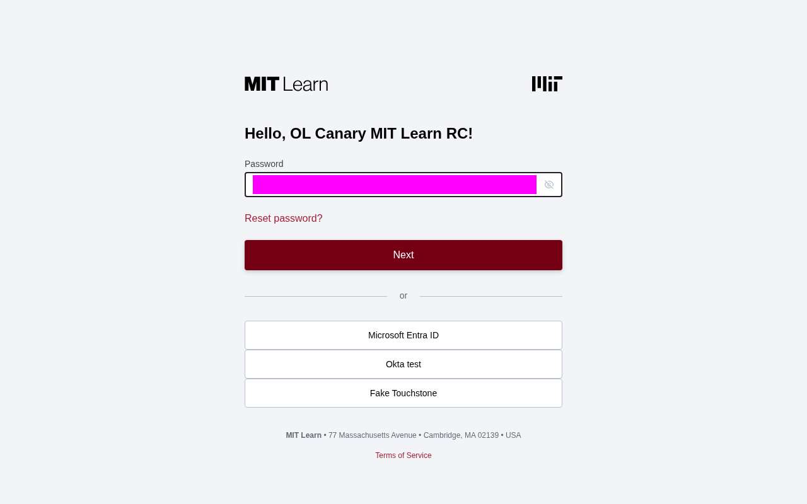
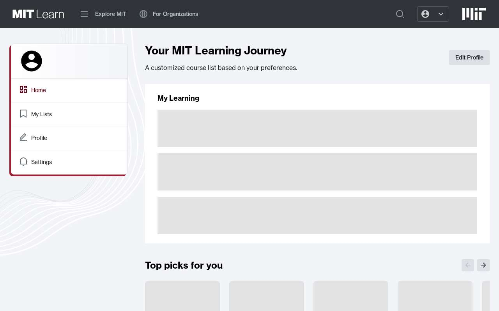
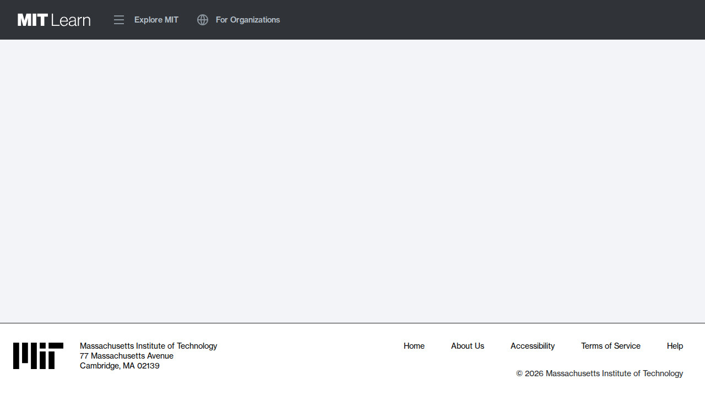

# Canary journeys, step by step

What each canary does to each property, one screenshot per step, with what is asserted
at that point and why. You should not need to open a spec to follow it.

This page is for reading. The authority is the specs themselves, and the reasons behind
each rule are in [`../AGENTS.md`](../AGENTS.md) and the property's own
[`README.md`](../specs/mit-learn/README.md). When they disagree, the spec wins and this
page is stale. **A new or changed journey updates this page in the same PR** (see
[Keeping this page current](#keeping-this-page-current)).

Every screenshot was taken against RC, in Chromium at 1280×800, by
[`capture/mit-learn.capture.ts`](capture/mit-learn.capture.ts). Content on RC changes, so
the course names and counts in the pictures will not match a run today. The journeys do
not assert on them either.

- [mit-learn](#mit-learn): `canary-mit-learn`, against <https://rc.learn.mit.edu>
  - [Homepage](#homepage)
  - [Channel browse and resource drawer](#channel-browse-and-resource-drawer)
  - [Search by URL](#search-by-url)
  - [Signed in: login, dashboard, header search](#signed-in-login-dashboard-header-search)
- [What a failure looks like](#what-a-failure-looks-like)
- [Keeping this page current](#keeping-this-page-current)

---

## mit-learn

Pipeline `canary-mit-learn`, job `run-mit-learn-canary`, every 10 minutes, Chromium
only. Six tests in four spec files, running serially with one retry. The journeys are
ranked by the production traffic they stand in for; see the property
[README](../specs/mit-learn/README.md#journeys) for that ranking.

### Homepage

`specs/mit-learn/homepage.spec.ts`: anonymous.


**1. `/` renders its `<main>` in a real browser.** That is the entire assertion. It says
nothing about the hero copy, the featured courses or the search box, because all of that
is CMS content. An assertion on it would turn red when an editor changes a word.
This journey catches a blank page, a crashed bundle or a 5xx. The other journeys cover
everything past that.

### Channel browse and resource drawer

`specs/mit-learn/channel-and-drawer.spec.ts`: anonymous. Two tests against the channel
route `/c/[channelType]/[name]`, the most-rendered route in production. The channel is
`/c/unit/ocw`. It is a unit channel, not a curated topic channel, so it exists as long
as OCW publishes anything.

#### Test 1: the channel renders its indexed listing



**1. The channel's `h1` reads "MIT OpenCourseWare".** The locator is `level: 1`, because
the same name also appears in a "Search within…" `h2` further down.



**2. The index-fed listing holds at least one card, and the `All (N)` tab has N ≥ 1.**
The assertion is scoped to the `tabpanel`, not the whole page. The page also carries a
hand-curated "Featured Courses" strip, and an unscoped check would find a card there and
pass straight through an empty search index. `All (0)` is what an emptied or
half-rebuilt index looks like, with every tab and filter still on screen. So the count
is asserted, not just the tab.

#### Test 2: a card opens the drawer, and the same link works as a cold load



**3. Clicking the first card opens the drawer.** The URL gains `?resource=<id>`, and a
dialog opens whose heading is the card's own title. The journey reads that title off the
card rather than pinning a resource, so it has no content of its own to go stale. The
click is retried as a unit with `toPass`: a click that lands before React hydrates is
silently swallowed.



**4. The identical URL, loaded as a fresh navigation, renders the same resource.** This
is not a repeat of step 3. Step 3 was client-side routing. Here the server fetches the
resource while rendering, which is the path a shared or indexed drawer link takes. Two
assertions, split on purpose:

- the **document title** names the resource (server-rendered), and
- the **dialog heading** names it (client-rendered).

When the server-side fetch fails, Next answers **HTTP 200** with a `Not Found` title and
the channel still on screen. Nothing on the page looks broken. Which of the two
assertions failed tells triage which half broke.

### Search by URL

`specs/mit-learn/search-direct-url.spec.ts`: anonymous. Production traffic reaches
`/search` mostly as a URL that already carries its parameters (shared links, bookmarks,
search engines), not by typing.


**1. `/search?q=mathematics&resource_type=course` returns filtered results.** In order:

- The URL still carries both `q` and `resource_type` after any redirect. A redirect that
  drops them renders an unfiltered page that looks healthy.
- A "Search Results" heading renders (visually hidden, which is why it is not in the
  picture).
- `Courses (N)` has N ≥ 1.
- `Programs (0)` and `Learning Materials (0)`. This is what proves the facet was
  *applied*. A backend that ignored it would leave those tabs populated.
- The first card in the listing is named `Course: …`.

`mathematics` lives in `specs/mit-learn/helpers/fixtures.ts`, shared with the signed-in
search below. The whole catalogue losing every mathematics course is not a realistic
content change. An empty index is, so a failure here is worth paging on.

### Signed in: login, dashboard, header search

`specs/mit-learn/login-and-search.spec.ts`: signed in, as the dedicated RC canary
account. Login happens **once per worker**, in `helpers/signed-in-test.ts`, and both
tests reuse the session. In the pipeline, the login screens are deliberately **not**
traced or screenshotted, because they would carry the account's address into published
artifacts. The pictures below come from the capture script, with the address and
password masked.


**1. Login starts at `/`, not at a deep link.** `main` renders, then the journey clicks
**Log In**. A homepage that no longer offers a way in is a user-facing outage, and
jumping straight to the IdP would miss it.



**2. Keycloak email screen** (`sso-qa.ol.mit.edu`, realm `olapps`). The realm is
identity-first: the email goes in alone, then **Next**.



**3. The password screen is asserted positively before anything is typed.** It greets
the account by its Keycloak display name. The journey
checks the URL is on the same IdP origin and ends `/login-actions/authenticate`.
An unknown account is not refused. It is redirected: to Touchstone for an `@mit.edu`
address, or to the captcha'd signup form for anything else. Typing the canary password
into either of those would be much worse than failing. If Keycloak *does* reject the
password, `sign-in.ts` writes a marker file and refuses to submit it again. The realm
permanently locks the account after 20 failures.



**4. `/dashboard` shows "Your MIT Learning Journey", a User Menu button, and no Log In
link.** Anonymous, this URL redirects to Keycloak, so arriving at the dashboard's own
heading proves a session, not just a completed redirect.


**5. Typing `mathematics` into the homepage search box lands on `/search?q=mathematics`,
with a "Search Results" heading, a result card, and `Courses (N)` with N ≥ 1.** The
fill-and-Enter is retried as a unit. The box is in the server-rendered markup before
React is listening, so an early keystroke is dropped. WebKit exposed this race; Chromium
only wins it by being fast.


**6. On the Courses tab, a card named `Course: …mathematics…` is visible.** This checks
relevance, not a count, because any specific number goes stale at the next content sync.

---

## What a failure looks like

A red `canary-mit-learn` build uploads its traces, screenshots, video and HTML report to

```
s3://ol-eng-artifacts/canary-results/canary-mit-learn/run-mit-learn-canary/<YYYYMMDDTHHMMSSZ>/
```

There is no build number in the path, because task containers get no `BUILD_*`
variables. Match the directory to the build by its start time. Each failed attempt gets
its own directory under `artifacts/`, and the retry's ends `-retry1`.

This one is from 2026-09-20T18:48Z (`…/20260920T184838Z/artifacts/mit-learn-login-and-search-…-chromium/test-failed-1.png`):



Step 4 above, failing. The session was valid and the header and footer rendered, but
`main` is empty, so "Your MIT Learning Journey" never appeared within the 15s expect
timeout. It failed identically on the retry, so the build went red. The same directory
holds `error-context.md`, which has the failing locator and an accessibility snapshot of
the page. There is also `trace.zip`: open it at <https://trace.playwright.dev/> for the
network log and a DOM snapshot at every step, which is usually the fastest route to a
cause.

A journey that fails once and passes on its retry leaves a **green** build and uploads
nothing here. Its only record is `stats.flaky` in the per-run `results.json` under
`s3://ol-eng-artifacts/canary-runs/`. See
[`../AGENTS.md`](../AGENTS.md#the-per-run-record-and-why-a-flake-needs-one).

---

## Keeping this page current

When you add or change a journey:

1. Mirror the change in `capture/<property>.capture.ts`. It follows the specs step for
   step and keeps their assertions, so a broken page fails the capture rather than being
   committed as a picture.
2. Regenerate the images:

   ```bash
   cd src/ol_concourse/pipelines/canaries
   CANARY_BASE_URL=https://rc.learn.mit.edu \
     npx playwright test -c docs/capture/playwright.capture.config.ts
   ```

   The signed-in test needs `CANARY_USER_EMAIL` and `CANARY_USER_PASSWORD`, supplied the
   same way as for a local run (see the `run-canary-locally` skill). It is a real login
   against the same account the pipeline uses, so treat it like one. The capture config
   has `retries: 0` and honours the same rejected-credential marker as `sign-in.ts`.
   Add `--grep-invert "signed in"` if you only changed an anonymous journey.
3. **Look at every signed-in image before committing it.** The masks cover the address
   wherever the page shows it as text. They cannot cover something new that a future
   page starts showing. Never commit a frame whose visible URL carries a token.
4. Update the section here.

A new property gets a new `## <property>` section and its own
`capture/<property>.capture.ts`, written to `images/<property>/<journey>/`. Nothing
above changes. Frames are viewport-only JPEG, around 60KB each. Keep them that way, since
they are binaries in git.

The capture script is not a canary and the pipeline never runs it. Its config lives
here, and the scheduled job runs `playwright test specs/<property>` against the root
config. That separation is deliberate. A canary that saved a full screenshot set on
every green run, 144 times a day, would be a different cost and a different artifact
story.
