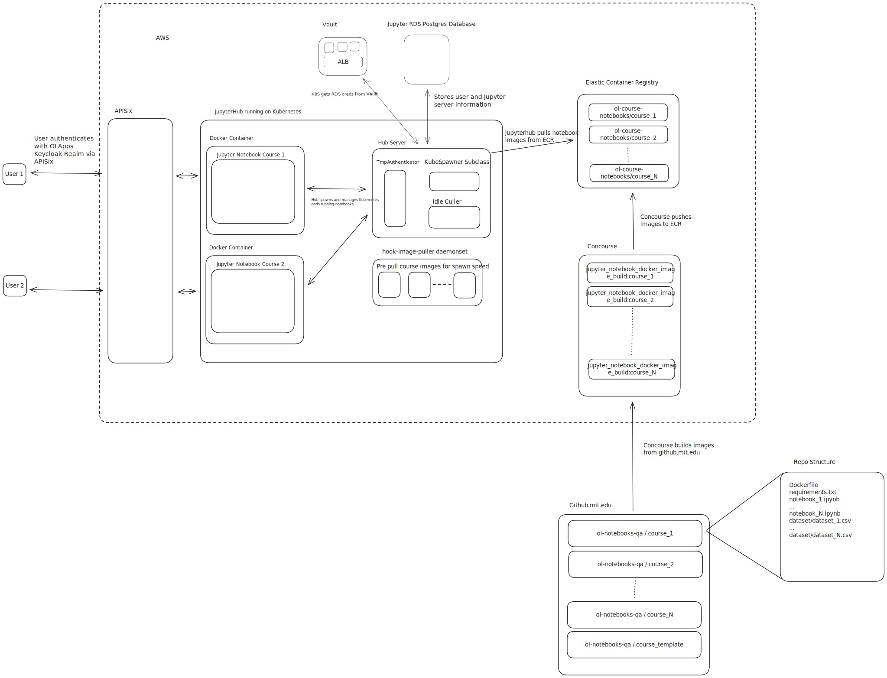

# Architecture

# Image Building
https://github.mit.edu/ol-notebooks is an org containing a template repository and all course repositories. Each course repository contains a Dockerfile and requirements.txt file alongside any Jupyter notebooks and data.

Concourse runs a [parameterized job](https://cicd.odl.mit.edu/?search=team%3A%22infrastructure%22%20group%3A%22jupyter_notebook_docker_image_build%22) which pulls from the course repositories, constructs a docker image to bundle everything together and push to a [private ECR repository](https://us-east-1.console.aws.amazon.com/ecr/repositories/private/610119931565/ol-course-notebooks?region=us-east-1) we maintain. The dockerfiles use the [official Jupyter pytorch docker images](https://jupyter-docker-stacks.readthedocs.io/en/latest/using/selecting.html#jupyter-pytorch-notebook) as a base and install tensorflow as well. The code to provision the pipelines is [here](../../../ol_concourse/pipelines/container_images/jupyter_courses.py) and the Pulumi code to set up the ECR repository is [here](../../../ol_infrastructure/infrastructure/aws/ecr/__main__.py).

# Jupyterhub

Jupyterhub will use the [KubeSpawner library](https://github.com/jupyterhub/kubespawner) (with some very slight modifications to enable [image selection via query param](dynamicImageConfig.py)) to allow users to start up and interact with a set of images we maintain. For courses, this will involve Jupyterhub starting up a notebook server for the user by pulling the corresponding course image from ECR.

The backing database is a Postgres RDS instance.

Images are pre-pulled via [continuous-pre-puller](https://z2jh.jupyter.org/en/stable/administrator/optimization.html#pulling-images-before-users-arrive) daemonsets. This is currently configured to pull all 4 existing images we build and maintain via specification of an extraImages block.

Jupyterhub domains are currently gated by an SSO login to the olapps Keycloak realm. Once authenticated with Keycloak, Jupyterhub is set up to use the TmpAuthenticator class. When accessing the /tmplogin endpoint provided by the authenticator, Jupyterhub will unconditionally authenticate users as a random UUID. This ensures that users can spin up ephemeral notebooks provided they are able to authenticate with MIT Learn.

Culling is performed via the [jupyterhub-idle-culler](https://github.com/jupyterhub/jupyterhub-idle-culler) configured via [Helm chart](https://z2jh.jupyter.org/en/latest/resources/reference.html#cull). It currently culls both running, inactive servers as well as users. Culling users is important as we will accumulate UUID-keyed users and sessions in the database over time.

## Authoring Workflow

### Adding a New Course
At the moment, adding a new course involves a few manual steps:
1. Create a new repository in the [ol-notebooks-qa](https://github.mit.edu/ol-notebooks) org using the [template repo](https://github.mit.edu/ol-notebooks/ol-notebook-repo-template).
1. Author your changes. If you started from the template repo, the only required changes you'll need to make are adding your notebooks and data, adding any dependencies to either requirements.txt or the Dockerfile, and ensuring that the Dockerfile copies your notebooks and data into the ${NB_USER} home directory.
1. Make changes to ol-infrastructure to add a new image build job in Concourse. This involves adding a new job to the [jupyter_courses.py](../../../ol_concourse/pipelines/container_images/jupyter_courses.py) file and provisioning the new pipeline via fly command. Additionally, add the new image to the QueryStringKubeSpawner's `KNOWN_IMAGES` in [jupyterhub_config.py](jupyterhub_config.py) and to `COURSE_NAMES` in [JupyterHub's Pulumi code](__main__.py).
    - Here's a example PR which added a new course called `uai_source-uai.intro`: https://github.com/mitodl/ol-infrastructure/pull/3630
1. Apply your ol-infrastructure changes to the dev/stage/prod environments and unpause your new Concourse job to start building the image.
1. Once the image is built and pushed to ECR, you should be able to start a new notebook server using the new image. You can construct the URL using the following format: `https://nb.learn.mit.edu/tmplogin?course=<IMAGE_TAG>&notebook=<URL_ENCODED_PATH_TO_NOTEBOOK_FILE>`.
    - For example, if your image URI is `610119931565.dkr.ecr.us-east-1.amazonaws.com/ol-course-notebooks:uai_source-uai.intro` and your notebook is at `lectures/lecture1/mod5_lec1.ipynb`, the URL would be `https://nb.learn.mit.edu/tmplogin?course=uai_source-uai.intro&notebook=lectures%2Flecture1%2Fmod5_lec1.ipynb`.
1. Once started, it's good practice to run the entire notebook. This will help you catch any dependency issues or let you know if the notebook uses too much memory to execute.

### Updating an Existing Course
The steps for updating a new course is a subset of the steps for adding a new course:
1. Author your changes in the course repo. If it is an update to an existing course, it should already have a Concourse build pipeline which will automatically attempt to build an updated image.
1. Once the image is built, you should be able to start a notebook server with the updated image automatically. If you adjusted the notebook directory structure, you may need to construct a new URL, but you will not need to make any additional infrastructure changes.
1. Test the updated image by running through the notebook as you would for a new one.

### Troubleshooting
If you run into issues, here are some common things to check:
- If you get the wrong image when you log in, verify that you've specified the right course parameter and that the value is in `KNOWN_IMAGES` in `jupyterhub_config.py`.
- If the image starts but you get a 404, verify that the notebook path is correct and URL encoded.
